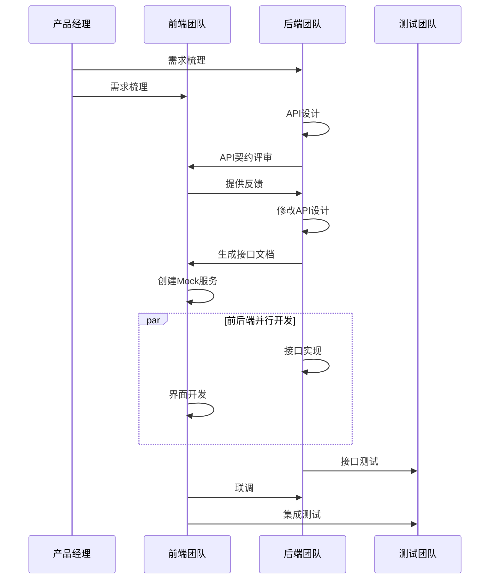
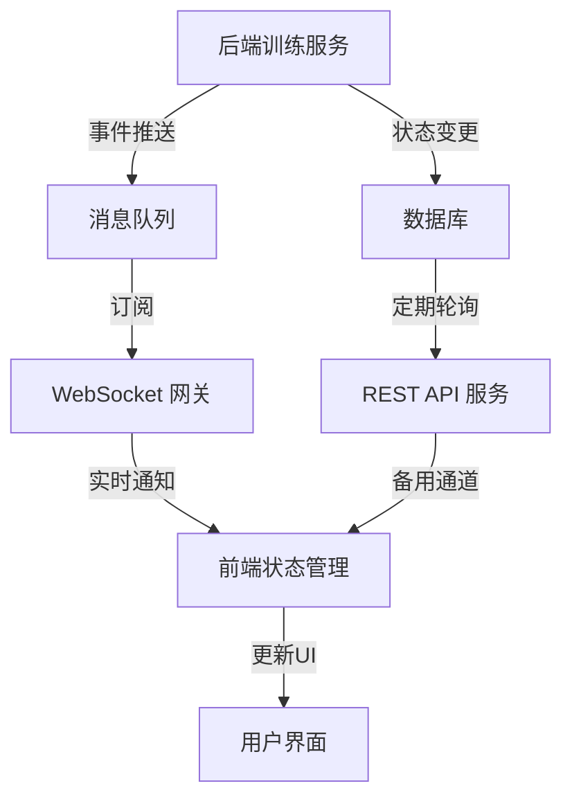

# Frontend Backend Integration 外部原始素材 - v1

## 接口契约与数据流设计

- 关注前端与后端接口契约的一致性，明确各 API 调用的参数、数据格式以及错误处理机制。
- 分析 `frontend_tech_stack_novabrain_v3.md` 与 `api_design_review_lowcode_engine_v0.1.md` 中对于数据流和状态管理的设计考量。
- 当前实施的接口契约文档采用 OpenAPI 3.0 规范，并通过自动化工具生成前端类型定义和 API 客户端。

### API 契约示例：模型部署

```yaml
paths:
  /api/v1/models/deploy:
    post:
      summary: 部署模型到指定环境
      operationId: deployModel
      tags:
        - Models
      requestBody:
        required: true
        content:
          application/json:
            schema:
              $ref: '#/components/schemas/ModelDeployRequest'
      responses:
        '202':
          description: 部署请求已接受，返回部署任务ID
          content:
            application/json:
              schema:
                $ref: '#/components/schemas/DeploymentTask'
        '400':
          description: 参数错误
          content:
            application/json:
              schema:
                $ref: '#/components/schemas/ErrorResponse'
        '401':
          description: 未授权访问
          content:
            application/json:
              schema:
                $ref: '#/components/schemas/ErrorResponse'

components:
  schemas:
    ModelDeployRequest:
      type: object
      required:
        - model_id
        - version
        - environment
      properties:
        model_id:
          type: string
          example: "bert-base-uncased"
        version:
          type: string
          example: "1.0.2"
        environment:
          type: string
          enum: [dev, staging, production]
        deployment_name:
          type: string
        config:
          $ref: '#/components/schemas/DeploymentConfig'
```

## 协作流程与角色分工

- 描述前后端团队在集成过程中的沟通流程，特别关注前端负责人李工和后端负责人孙工的角色分配。
- 强调接口变更通知机制、Mock 数据规范，以及如何协调不同实现进度，确保接口文档的及时更新。
- 前后端集成测试由专门的质量保障团队（周工主导）负责，通过自动化接口测试保障一致性。

### 协作流程图



## 行业最佳实践与风险提示

- 结合微服务架构趋势，探讨数据格式不统一、状态同步失败等常见问题及相应解决策略。
- 参考行业最佳实践，提出统一接口文档管理与定期评审的建议，降低集成风险。
- 采用契约驱动开发 (CDD) 和消费者驱动契约 (CDC) 测试的混合方法，确保前后端无缝集成。

## 前后端数据状态同步策略

### 数据流图：模型训练状态同步



### 前端状态管理代码示例

```typescript
// 使用 React Query 和 WebSocket 结合的状态管理策略
const useModelTrainingStatus = (modelId: string) => {
  // REST API 数据获取（基础状态和兜底方案）
  const { data, refetch } = useQuery({
    queryKey: ['modelStatus', modelId],
    queryFn: () => api.getModelStatus(modelId),
    refetchInterval: 30000, // 30秒轮询作为兜底
  });
  
  // WebSocket 实时更新
  useEffect(() => {
    const socket = socketService.connect();
    socket.on(`model:${modelId}:status`, (update) => {
      // 使用 React Query 的缓存更新能力
      queryClient.setQueryData(['modelStatus', modelId], (old) => ({
        ...old,
        ...update,
        lastUpdated: new Date().toISOString(),
      }));
    });
    
    return () => {
      socket.off(`model:${modelId}:status`);
      socket.disconnect();
    };
  }, [modelId]);
  
  return { 
    status: data, 
    refetch,
    // 提供强制刷新方法（用于异常情况）
    forceUpdate: () => queryClient.invalidateQueries(['modelStatus', modelId]) 
  };
};
```

## 实际集成问题案例与解决方案

### 案例1: API 响应结构不一致

#### 问题描述
- 不同的后端开发者实现的 API 响应格式不一致：有些返回嵌套在 `data` 字段中的数据，有些直接返回数据对象
- 导致前端不得不为每个接口编写特定的数据提取逻辑

#### 解决方案
1. 定义统一的 API 响应封装格式：
```typescript
interface ApiResponse<T> {
  data: T;
  meta?: {
    pagination?: {
      page: number;
      pageSize: number;
      total: number;
    }
  };
  error?: {
    code: string;
    message: string;
    details?: any;
  };
}
```

2. 实现后端全局响应处理器，确保所有 API 返回一致格式
3. 前端使用拦截器处理响应，提取 `data` 字段：
```typescript
// Axios 响应拦截器
axios.interceptors.response.use(
  (response) => {
    // 统一从 response.data.data 提取实际数据
    return response.data.data;
  },
  (error) => {
    // 统一错误处理
    const apiError = error.response?.data?.error || {
      code: 'UNKNOWN_ERROR',
      message: '未知错误',
    };
    // 可以在这里进行全局错误处理，如错误通知、日志等
    return Promise.reject(apiError);
  }
);
```

### 案例2: 状态同步失败

#### 问题描述
- 长时间运行的模型训练流程，WebSocket 连接不稳定导致前端状态不同步
- 用户看到不准确的训练状态，造成操作混乱

#### 解决方案
1. 实现混合状态同步策略：
   - 主要依靠 WebSocket 实时更新
   - 定期轮询作为备份机制
   - 用户操作时强制刷新

2. 增加前端状态一致性校验：
```typescript
// 状态一致性校验
const validateStatus = (cachedStatus, latestStatus) => {
  // 检查时间戳是否过旧
  const isTooOld = new Date(cachedStatus.lastUpdated) < 
    new Date(Date.now() - 5 * 60 * 1000); // 5分钟
  
  // 检查状态是否矛盾（如已完成状态变回进行中）
  const isContradictory = 
    statusPriority[cachedStatus.status] > statusPriority[latestStatus.status];
  
  return !isTooOld && !isContradictory;
};
```

3. 实现 WebSocket 重连机制和错误恢复

### 案例3: 参数序列化差异

#### 问题描述
- 前端发送复杂对象参数（如日期、嵌套对象）时，与后端期望的格式不一致
- 特别是在过滤、排序和日期范围查询的 API 中频繁出现

#### 解决方案
1. 统一参数序列化规则：
```typescript
// 统一序列化配置
const serializerConfig = {
  dates: 'ISO', // ISO 8601 格式
  arrays: 'repeat', // a=1&a=2 形式
  objects: 'brackets' // a[b]=1&a[c]=2 形式
};

// 应用到 Axios
axios.defaults.paramsSerializer = {
  serialize: (params) => qs.stringify(params, serializerConfig)
};
```

2. 为后端框架配置对应的反序列化规则
3. 开发专门的参数转换工具，处理特殊情况

## 集成测试与验证

### API 集成测试策略

针对前后端接口开发了三级测试策略：

1. **契约测试**：验证 API 实现是否符合 OpenAPI 规范
   - 使用工具：Prism Mock Server, Dredd
   - 责任方：后端团队

2. **API 自动化测试**：测试实际 API 行为
   - 使用工具：Jest + Supertest, Postman Collections
   - 责任方：QA 团队

3. **前后端集成测试**：真实环境的端到端测试
   - 使用工具：Cypress
   - 责任方：QA 团队 + 前端团队

### 测试覆盖率目标

| 测试类型 | 覆盖率目标 | 当前覆盖率 | 责任方 |
|---------|-----------|-----------|------|
| 契约测试 | 100% | 92% | 后端 |
| API 自动化测试 | 85% | 78% | QA |
| 集成测试 | 关键路径 100% | 70% | QA + 前端 | 