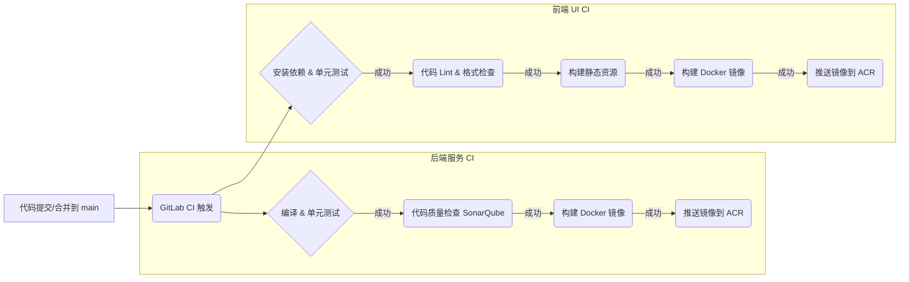

# NovaBrain 3.0 CI/CD 管道当前配置 v1.0

**文档版本**: 1.0
**日期**: 2024-01-20
**状态**: 现状描述
**编制**: 赵工 (DevOps 专家)

## 1. 概述

本文档描述了 NovaBrain 3.0 项目当前使用的 CI/CD 管道配置和流程。目标是为后续的流程优化（Ex4_6）提供基线信息。

## 2. 工具链

*   **代码仓库**: GitLab (私有化部署)
*   **CI/CD 服务**: GitLab CI
*   **构建工具**: Docker, Maven (Java 后端), Node.js/npm (前端)
*   **镜像仓库**: 阿里云 ACR (容器镜像服务)
*   **部署工具**: Helm, Argo CD
*   **基础设施管理**: Terraform (部分使用), 手动配置 (部分历史遗留)
*   **测试框架**: JUnit (Java), Jest (React), Pytest (Python/模型), Postman/Newman (API)
*   **容器编排**: 阿里云 ACK

## 3. CI 流程 (代码合并到主分支触发)

以下流程针对核心后端服务（Java/Spring Boot）和前端 UI (React) 的典型配置：



*   **触发器**: 合并请求 (Merge Request) 被接受并合并到 `main` 分支时触发。
*   **主要阶段**: 
    1.  **编译/构建**: 拉取代码，执行 `mvn package` (后端) 或 `npm run build` (前端)。
    2.  **单元测试**: 运行 `mvn test` 或 `npm test`。
    3.  **代码质量 (后端为主)**: 集成 SonarQube 进行静态分析，检查代码复杂度、潜在 Bug、安全漏洞。
    4.  **镜像构建**: 使用 Dockerfile 构建服务镜像，标记版本号。
    5.  **镜像推送**: 将构建好的镜像推送到阿里云 ACR 指定的仓库。
*   **问题与挑战**: 
    *   单元测试覆盖率不均，部分模块较低。
    *   CI 运行时间较长，特别是对于大型后端服务。
    *   代码质量检查门禁有时被绕过。

## 4. CD 流程 (基于 Argo CD)

当前使用 Argo CD 实现 GitOps 流程，将应用部署到 Staging 和 Production 环境。

```mermaid
graph TD
    A[CI 成功，新镜像推送到 ACR] --> B(更新 K8s 配置仓库);
    B --> C{Argo CD 检测到变更};
    C --> D[自动同步到 Staging 环境];
    D --> E(运行自动化集成/API测试);
    E -- 测试成功 --> F{手动审批 (Release Manager)};
    F -- 批准 --> G[Argo CD 同步到 Production 环境];
    G --> H(金丝雀发布/滚动更新);
    H --> I(监控部署状态);
```

*   **触发器**: CI 流程成功并将新镜像推送到 ACR 后，**手动或通过脚本**更新存储 Kubernetes 应用配置（Helm Charts 或 Kustomize 文件）的 Git 仓库，指定使用新的镜像版本。
*   **Argo CD 配置**: Argo CD 配置为监视配置仓库的特定分支（如 `staging` 和 `production`）。
*   **Staging 环境部署**: 
    1.  开发者更新 Staging 配置分支，指定新镜像版本。
    2.  Argo CD 检测到配置仓库的 Staging 分支与集群状态不一致。
    3.  Argo CD 自动将变更（使用新镜像的 Pod）同步到 ACK 集群的 Staging Namespace。
    4.  在 Staging 环境自动运行集成测试和端到端 API 测试 (使用 Postman/Newman 脚本)。
*   **Production 环境部署**: 
    1.  Staging 测试通过后，**需要 Release Manager 手动批准**（通过 GitLab MR 审批或 Argo CD UI 操作）。
    2.  批准后，将 Staging 分支的配置合并到 Production 分支。
    3.  Argo CD 检测到 Production 分支的变更。
    4.  Argo CD 将变更同步到 ACK 集群的 Production Namespace。
    5.  默认采用 Kubernetes 的**滚动更新 (Rolling Update)** 策略。对于关键服务（如模型推理），正在尝试**金丝雀发布**（手动调整流量比例或使用 Flagger/Argo Rollouts - 实验阶段）。
*   **问题与挑战**: 
    *   手动更新配置仓库易出错且效率不高。
    *   手动审批环节是瓶颈，有时延迟发布。
    *   自动化测试覆盖不全，特别是针对复杂业务流程和模型逻辑。
    *   金丝雀发布策略尚未完全成熟和自动化。
    *   缺乏部署后的自动化验证和健康检查机制。
    *   配置管理（Helm Charts/Kustomize）有时变得复杂难维护。
    *   缺乏明确的发布审计追踪机制。

## 5. 环境管理

*   **开发环境**: 开发者本地 Docker 环境或共享的开发 K8s Namespace。
*   **测试环境**: 独立的 K8s Namespace，用于 QA 手动测试和部分自动化测试。
*   **Staging 环境**: 独立的 K8s Namespace，模拟生产环境配置，用于部署前的最终验证和 UAT。
*   **Production 环境**: 生产 K8s Namespace，面向最终用户。
*   **配置差异**: 不同环境的配置（如数据库连接、资源限制、副本数）通过不同的 Helm Value 文件或 Kustomize Overlay 管理。
*   **问题与挑战**: 
    *   环境间配置漂移偶有发生。
    *   Staging 环境有时不稳定，影响测试和发布流程 (参考 `sprint_retrospective_notes_2023_11_15.md`)。
    *   基础设施的创建和管理部分依赖手动操作。

## 6. 总结

当前的 CI/CD 流程基于 GitLab CI 和 Argo CD，实现了基本的自动化构建和 GitOps 部署。然而，在效率、可靠性、测试覆盖、发布策略和环境管理方面存在明显的优化空间，特别是在满足医疗/金融等高要求行业的快速、安全、合规发布需求方面。 