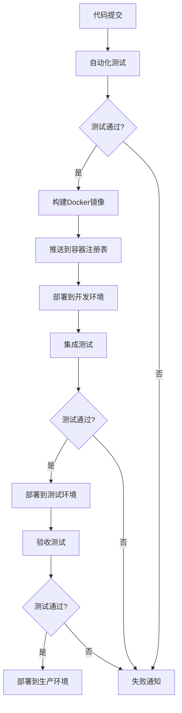
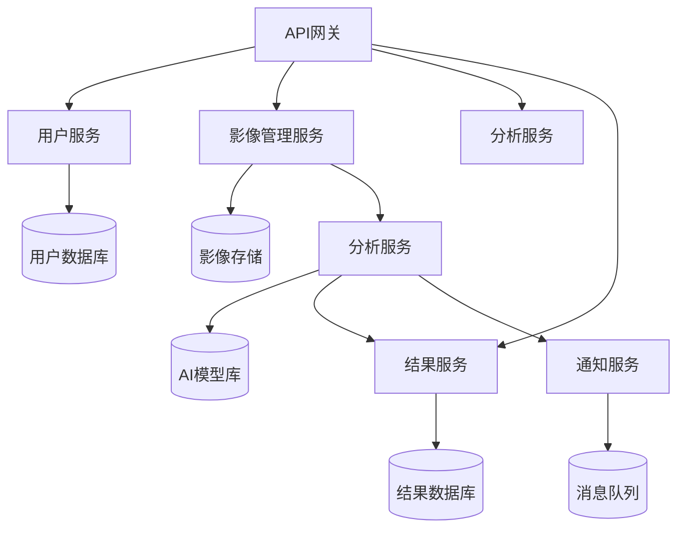

# 医疗影像API部署计划

| 文档信息 | 详情 |
|---------|------|
| 项目名称 | HealthVision 医疗影像API |
| 文档版本 | v1.0 |
| 创建日期 | 2023-11-15 |
| 作者 | 郭刚 (DevOps工程师) |
| 审阅者 | 王伟 (后端负责人), 陈明 (产品经理) |
| 状态 | 草稿 |

## 1. 概述

本文档描述了HealthVision医疗影像API的详细部署计划，包括部署架构、环境要求、配置管理、部署流程、监控策略以及回滚方案。该API将提供医疗影像分析功能，包括肺部CT结节检测、脑部MRI肿瘤分割和胸部X光分类等。

## 2. 部署架构

HealthVision医疗影像API采用微服务架构，主要包含以下组件:

- **API网关**: 负责请求路由、认证和限流
- **用户服务**: 管理用户账户和权限
- **影像管理服务**: 处理影像上传和存储
- **分析服务**: 执行影像分析任务
- **结果服务**: 存储和管理分析结果 
- **通知服务**: 处理异步通知和事件

### 2.1 部署环境

我们将支持两种部署模式：

#### 2.1.1 云部署架构


- **Kubernetes集群**: 运行在AWS EKS上
- **API网关**: AWS API Gateway + Kong
- **计算节点**: EC2实例 (CPU和GPU混合)
- **数据存储**: 
  - MongoDB Atlas (文档数据)
  - S3 (影像数据)
  - ElastiCache (Redis, 缓存)
- **消息队列**: Amazon SQS
- **监控**: CloudWatch + Prometheus + Grafana
- **日志**: ELK Stack

#### 2.1.2 本地部署架构


- **Kubernetes集群**: 本地部署
- **API网关**: Kong
- **计算节点**: 物理服务器或虚拟机
- **数据存储**:
  - MongoDB
  - MinIO (S3兼容存储)
  - Redis
- **消息队列**: RabbitMQ
- **监控**: Prometheus + Grafana
- **日志**: ELK Stack

## 3. 部署先决条件

### 3.1 硬件要求

#### 3.1.1 云部署 (AWS)

| 组件 | 实例类型 | 数量 | 存储 |
|------|---------|------|------|
| API和微服务 | t3.large | 4+ | 100GB EBS |
| 数据库 | MongoDB Atlas M30 | 1集群 | 500GB |
| 缓存 | ElastiCache (M5) | 3节点 | 32GB |
| 影像分析 (CPU) | c5.4xlarge | 2+ | 200GB EBS |
| 影像分析 (GPU) | g4dn.xlarge | 2+ | 200GB EBS |
| 对象存储 | S3 Standard | N/A | 初始1TB |

#### 3.1.2 本地部署

| 组件 | 最低配置 | 推荐配置 | 数量 |
|------|---------|---------|------|
| Kubernetes主节点 | 4CPU, 8GB RAM | 8CPU, 16GB RAM | 3 |
| Kubernetes工作节点 (CPU) | 8CPU, 32GB RAM | 16CPU, 64GB RAM | 3+ |
| Kubernetes工作节点 (GPU) | 8CPU, 32GB RAM, NVIDIA T4 | 16CPU, 64GB RAM, NVIDIA A10 | 2+ |
| 存储节点 | 8CPU, 32GB RAM, 2TB SSD | 16CPU, 64GB RAM, 4TB SSD | 3+ |

### 3.2 软件要求

#### 3.2.1 云部署

- AWS账户与适当权限
- AWS CLI v2+
- kubectl v1.22+
- Helm v3.8+
- Terraform v1.0+

#### 3.2.2 本地部署

- Kubernetes v1.22+
- Docker v20.10+
- NVIDIA Container Toolkit (GPU节点)
- kubectl v1.22+
- Helm v3.8+
- Ansible v2.12+

### 3.3 网络要求

- 支持HTTPS (TLS 1.3)
- 固定IP地址或域名
- 防火墙配置允许必要端口
- 内部服务网络隔离
- VPN接入(本地部署)

### 3.4 安全要求

- TLS证书
- 网络安全组/防火墙规则
- RBAC配置
- 密钥管理解决方案
- 符合HIPAA/GDPR合规要求的配置

## 4. 容器化策略

所有服务组件将使用Docker容器化，并通过Kubernetes进行编排。

### 4.1 Docker镜像

| 服务 | 基础镜像 | 维护者 |
|------|---------|-------|
| API网关 | kong:2.8 | DevOps团队 |
| 用户服务 | python:3.10-slim | 后端团队 |
| 影像管理服务 | python:3.10-slim | 后端团队 |
| 分析服务 (CPU) | python:3.10-slim | AI团队 |
| 分析服务 (GPU) | nvidia/cuda:11.7.1-cudnn8-runtime-ubuntu20.04 | AI团队 |
| 结果服务 | python:3.10-slim | 后端团队 |
| 通知服务 | python:3.10-slim | 后端团队 |

### 4.2 容器注册表

- **云部署**: AWS ECR
- **本地部署**: Harbor Registry

## 5. CI/CD管道

### 5.1 CI/CD工具链

- **代码仓库**: GitLab
- **CI/CD平台**: GitLab CI/CD
- **容器注册表**: AWS ECR / Harbor
- **配置管理**: Helm
- **基础设施即代码**: Terraform (云) / Ansible (本地)
- **密钥管理**: AWS Secrets Manager / HashiCorp Vault

### 5.2 部署流水线



### 5.3 环境配置

| 环境 | 用途 | 自动化级别 | 扩展策略 |
|------|------|-----------|---------|
| 开发 | 开发测试 | 全自动CI/CD | 固定规模 |
| 测试 | QA和集成测试 | 自动部署，手动触发 | 固定规模 |
| 预生产 | 性能测试和最终验证 | 手动触发部署 | 生产规模的50% |
| 生产 | 真实用户使用 | 手动批准部署 | 自动扩展 |

## 6. 配置管理

### 6.1 配置策略

所有配置将按照以下层次管理：

1. **默认配置**: 容器镜像中的默认值
2. **环境配置**: Kubernetes ConfigMaps中的环境特定配置
3. **实例配置**: 通过环境变量注入的实例特定配置
4. **密钥**: 通过Kubernetes Secrets或外部密钥管理存储

### 6.2 配置项

| 配置类别 | 管理方式 | 示例 |
|---------|---------|------|
| 数据库连接 | 密钥 | MongoDB连接字符串 |
| API密钥 | 密钥 | OAuth客户端密钥 |
| TLS证书 | 密钥 | 服务TLS证书 |
| 服务URL | ConfigMap | 服务发现端点 |
| 资源限制 | Helm values | CPU/内存限制 |
| 日志级别 | ConfigMap | DEBUG, INFO, ERROR |

### 6.3 密钥管理

- **云部署**: AWS Secrets Manager + Kubernetes Secrets
- **本地部署**: HashiCorp Vault + Kubernetes Secrets

## 7. 部署流程

### 7.1 初始部署流程

1. **基础设施准备**
   - 使用Terraform/Ansible创建基础设施
   - 配置网络、存储和安全组件
   - 部署Kubernetes集群

2. **数据服务部署**
   - 部署MongoDB/Redis/MinIO
   - 创建必要的数据库和用户
   - 设置备份策略

3. **核心服务部署**
   - 部署API网关
   - 部署用户服务
   - 部署影像管理服务
   - 验证核心功能

4. **AI服务部署**
   - 部署分析服务
   - 部署结果服务
   - 加载AI模型

5. **辅助服务部署**
   - 部署通知服务
   - 部署监控和日志组件
   - 配置告警

6. **验证和测试**
   - 执行端到端测试
   - 验证所有服务通信
   - 执行安全扫描

### 7.2 更新部署流程

服务更新将使用蓝绿部署策略：

1. 部署新版本服务(绿)，保持当前版本(蓝)运行
2. 对新版本执行健康检查和功能测试
3. 逐步将流量从旧版本切换到新版本
4. 监控新版本的性能和错误率
5. 完成切换后，保留旧版本一段时间（便于快速回滚）
6. 确认稳定后清理旧版本

### 7.3 回滚策略

如果新版本出现问题，回滚流程如下：

1. 立即将流量路由回旧版本
2. 保留问题版本实例用于调查
3. 记录回滚原因和相关日志
4. 通知开发团队分析问题
5. 创建问题报告

## 8. 数据管理

### 8.1 数据备份策略

| 数据类型 | 备份频率 | 保留期 | 备份方式 |
|---------|---------|-------|---------|
| MongoDB数据 | 每日 | 30天 | 自动快照 + 复制集 |
| 用户数据 | 每日 | 90天 | 数据库备份 |
| 影像数据 | 持续 | 永久 | S3/MinIO复制 |
| 分析结果 | 每日 | 90天 | 数据库备份 |
| 配置数据 | 每次更改 | 10个版本 | GitOps |

### 8.2 数据迁移

初始部署不需要数据迁移。未来版本升级的数据迁移策略：

1. 设计向前和向后兼容的数据模型
2. 使用数据库迁移工具(如MongoDB Migrations)
3. 先升级数据库，再升级应用
4. 准备回滚脚本用于紧急情况

## 9. 网络配置

### 9.1 网络拓扑

#### 9.1.1 云部署

- VPC设置，跨可用区
- 公共子网(API网关)
- 私有子网(服务组件)
- 数据库子网(完全隔离)
- NAT网关用于出站流量

#### 9.1.2 本地部署

- 外部负载均衡层
- DMZ网络(API网关)
- 服务网络(应用组件)
- 数据网络(数据存储)
- 管理网络(监控和运维)

### 9.2 域名和TLS配置

- 申请通配符证书: *.api.healthvision.com
- 使用Let's Encrypt或商业CA
- 配置自动证书续订
- TLS终止在API网关或负载均衡器

## 10. 监控与告警

### 10.1 监控组件

- Prometheus (指标收集)
- Grafana (仪表盘)
- AlertManager (告警管理)
- ELK Stack (日志管理)
- Jaeger (分布式追踪)

### 10.2 关键指标

| 类别 | 指标 | 阈值 | 严重性 |
|------|------|------|-------|
| 系统 | CPU使用率 | >85% | 中 |
| 系统 | 内存使用率 | >90% | 高 |
| 系统 | 磁盘使用率 | >80% | 中 |
| 应用 | 请求延迟 | >2秒 | 中 |
| 应用 | 错误率 | >1% | 高 |
| 应用 | 处理队列积压 | >100 | 中 |
| 业务 | 分析任务完成率 | <95% | 高 |
| 业务 | 用户认证失败率 | >5% | 中 |

### 10.3 日志管理

- JSON格式结构化日志
- 日志级别：TRACE, DEBUG, INFO, WARN, ERROR, FATAL
- 生产环境默认使用INFO级别
- 包含请求ID的关联日志
- 包含用户ID（脱敏）的访问日志

### 10.4 告警策略

- **紧急(P1)**: 需立即响应，影响服务可用性
  - 短信+电话+邮件通知
  - 自动创建Incident
  - 24/7响应

- **高(P2)**: 2小时内需响应，影响部分功能
  - 短信+邮件通知
  - 工作时间内响应

- **中(P3)**: 24小时内需响应，性能退化
  - 邮件通知
  - 下个工作日处理

- **低(P4)**: 下次迭代修复，小问题
  - 记录问题
  - 定期评审

## 11. 容量规划

### 11.1 初始容量

- 预计用户数：500家医疗机构
- 并发用户：~100
- 每日分析任务：~1,000
- 影像存储需求：~10TB/年
- 数据库存储：~500GB/年

### 11.2 扩展策略

- **水平扩展**: 增加Pod副本数应对负载增加
  - API服务: 2-10 pods
  - 分析服务: 2-20 pods

- **垂直扩展**: 增加资源限制应对复杂任务
  - 内存密集型任务: 4GB-32GB
  - GPU任务: 1-4 GPU

- **存储扩展**: 
  - S3/MinIO容量按需增加
  - MongoDB分片策略

## 12. 安全控制

### 12.1 认证与授权

- OAuth 2.0 + JWT认证
- 基于角色的访问控制(RBAC)
- API密钥和令牌管理
- 服务间通信使用mTLS

### 12.2 数据安全

- 所有个人健康信息(PHI)加密存储
- 传输中加密(TLS 1.3)
- 静态数据加密(AES-256)
- 数据脱敏和匿名化处理

### 12.3 安全审计

- 所有API调用记录审计日志
- 管理操作完整日志
- 定期安全审计
- 符合HIPAA要求的访问日志

## 13. 灾难恢复

### 13.1 RPO和RTO目标

- **恢复点目标(RPO)**: <24小时
- **恢复时间目标(RTO)**: <4小时

### 13.2 灾难恢复策略

- **数据备份**: 
  - 完整备份: 每日
  - 增量备份: 每小时
  - 跨区域复制

- **服务恢复**:
  - 多可用区部署
  - 热备用实例
  - 自动故障转移

- **完整DR计划**:
  - 文档化DR流程
  - 季度DR演练
  - 指定DR协调员和响应团队

## 14. 部署时间线

| 阶段 | 开始日期 | 结束日期 | 负责人 |
|------|----------|----------|-------|
| 基础设施准备 | 2023-12-01 | 2023-12-10 | 郭刚 |
| 数据服务部署 | 2023-12-11 | 2023-12-15 | 郭刚, 王伟 |
| 核心服务部署 | 2023-12-16 | 2023-12-22 | 王伟, 你 |
| AI服务部署 | 2023-12-23 | 2024-01-05 | 李莉, 你 |
| 辅助服务部署 | 2024-01-06 | 2024-01-10 | 郭刚, 你 |
| 内部测试 | 2024-01-11 | 2024-01-20 | 刘静, 全体 |
| 合作医院试点 | 2024-01-21 | 2024-02-10 | 陈明, 杨医生 |
| 全面上线 | 2024-02-15 | - | 全体 |

## 15. 部署检查清单

### 15.1 部署前检查

- [ ] 所有自动化测试通过
- [ ] 安全扫描无严重漏洞
- [ ] 性能测试达到目标
- [ ] 所有配置审核完成
- [ ] 备份系统测试成功
- [ ] 回滚方案已准备
- [ ] 团队成员已培训
- [ ] 监控系统配置完成
- [ ] 文档已更新

### 15.2 部署后检查

- [ ] 服务健康检查通过
- [ ] 端到端测试通过
- [ ] 监控告警工作正常
- [ ] 日志记录正确
- [ ] 用户认证授权正常
- [ ] 示例分析任务成功执行
- [ ] 系统负载正常
- [ ] 外部可达性确认

## 16. 上线后计划

- 24小时轮班监控(首周)
- 每日回顾会议(首周)
- 性能调优和资源优化
- 首次使用数据分析
- 用户反馈收集
- 文档优化

## 17. 其他注意事项

- 所有医疗数据处理需符合HIPAA合规要求
- 部署和维护操作必须记录详细日志
- 配置变更需经过变更审批流程
- 重大更新需提前向用户公告
- 本地部署实施需专业团队到场支持

## 附录

### A. Kubernetes资源清单示例

```yaml
# API服务部署示例
apiVersion: apps/v1
kind: Deployment
metadata:
  name: api-service
spec:
  replicas: 3
  selector:
    matchLabels:
      app: api-service
  template:
    metadata:
      labels:
        app: api-service
    spec:
      containers:
      - name: api-service
        image: healthvision/api-service:v1.0.0
        ports:
        - containerPort: 8080
        resources:
          limits:
            cpu: "1"
            memory: "2Gi"
          requests:
            cpu: "500m"
            memory: "1Gi"
        livenessProbe:
          httpGet:
            path: /health
            port: 8080
          initialDelaySeconds: 30
          periodSeconds: 10
        readinessProbe:
          httpGet:
            path: /ready
            port: 8080
          initialDelaySeconds: 5
          periodSeconds: 5
```

### B. Terraform模块示例

```hcl
// EKS集群配置示例
module "eks" {
  source          = "terraform-aws-modules/eks/aws"
  version         = "18.0.0"
  cluster_name    = "healthvision-eks"
  cluster_version = "1.23"

  vpc_id     = module.vpc.vpc_id
  subnet_ids = module.vpc.private_subnets

  cluster_endpoint_private_access = true
  cluster_endpoint_public_access  = true

  node_groups = {
    app_nodes = {
      desired_capacity = 3
      max_capacity     = 6
      min_capacity     = 3
      instance_types   = ["t3.large"]
      disk_size        = 100
    }
    gpu_nodes = {
      desired_capacity = 2
      max_capacity     = 4
      min_capacity     = 2
      instance_types   = ["g4dn.xlarge"]
      disk_size        = 200
      taints = [
        {
          key    = "nvidia.com/gpu"
          value  = "true"
          effect = "NO_SCHEDULE"
        }
      ]
    }
  }
}
```

### C. 主要服务依赖关系图



---

**注**: 本部署计划为初稿，将根据项目进展和团队反馈持续更新。下一版本将包含更详细的监控仪表盘配置和容量规划数据。
