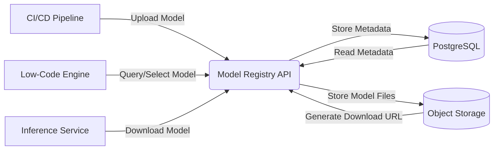

# NovaBrain 3.0 技术设计文档 - 模型注册表服务 (v1.0)

*   **模块**: 模型管理 (Model Management)
*   **服务**: 模型注册表 (Model Registry Service)
*   **版本**: 1.0
*   **状态**: 设计完成，待评审
*   **日期**: 2023-05-20
*   **作者**: 李工 (模型管理团队)
*   **评审人**: 张工 (架构师), 王工 (后端负责人), 相关开发工程师

## 1. 概述

模型注册表 (Model Registry) 是 NovaBrain 3.0 平台的核心组件之一，负责存储、版本化、管理和发现平台上的所有 AI 模型。它为模型的整个生命周期（从训练输出到生产部署）提供了一个中央存储库和事实来源 (Source of Truth)。其他服务（如 Low-Code 引擎、模型推理服务、CI/CD Pipeline）将通过其 API 与模型注册表交互。

## 2. 目标

*   **模型存储**: 安全可靠地存储不同格式的模型文件（如 ONNX, TensorFlow SavedModel, PyTorch state_dict, Scikit-learn pickle）及其元数据。
*   **版本管理**: 支持模型的语义化版本控制（如 `major.minor.patch`），跟踪模型版本的演进历史。
*   **元数据管理**: 存储和查询模型的详细元数据，包括训练参数、评估指标、训练数据集信息、标签、描述、依赖项等。
*   **模型发现**: 提供 API 以便其他服务能够按名称、版本、标签、指标等条件查询和检索模型。
*   **生命周期管理**: 支持标记模型版本状态（如 `Staging`, `Production`, `Archived`），便于管理和部署流程。
*   **访问控制**: (v1.1+) 实现基于角色的访问控制，限制模型的上传、下载和状态变更权限。
*   **可扩展性**: 易于扩展以支持新的模型格式和元数据字段。

## 3. 架构设计

*   **服务类型**: 独立微服务。
*   **技术栈**: Python (FastAPI), PostgreSQL (用于元数据存储), S3-compatible Object Storage (如 MinIO, Ceph, AWS S3，用于模型文件存储)。
*   **部署**: Docker 容器化，通过 Kubernetes 部署。
*   **核心流程**: 
    1.  **模型上传**: 客户端（如训练 Pipeline）调用 API 上传模型文件和元数据。服务将模型文件存储到对象存储，并将元数据写入 PostgreSQL 数据库，返回模型版本信息。
    2.  **模型查询/下载**: 客户端（如推理服务）调用 API 查询模型。服务根据查询条件从数据库检索元数据，并提供模型文件的下载链接（可以是预签名 URL）。
    3.  **状态变更**: 客户端（如 CI/CD Pipeline）调用 API 更新模型版本的状态（如 Staging -> Production）。

## 4. API 设计 (高级概述)

采用 RESTful API 风格，核心资源包括 `registered_models` 和 `model_versions`。

*   **Registered Models (注册模型)**: 代表一个逻辑上的模型实体，包含多个版本。
    *   `POST /registered-models`: 创建一个新的注册模型。
    *   `GET /registered-models`: 列出所有注册模型（支持过滤和分页）。
    *   `GET /registered-models/{model_name}`: 获取特定注册模型的详细信息。
    *   `DELETE /registered-models/{model_name}`: 删除一个注册模型及其所有版本。
*   **Model Versions (模型版本)**: 代表一个具体的、不可变的模型文件及其元数据。
    *   `POST /registered-models/{model_name}/versions`: 创建一个新的模型版本（包含模型文件上传）。
    *   `GET /registered-models/{model_name}/versions`: 列出特定模型的所有版本。
    *   `GET /registered-models/{model_name}/versions/{version}`: 获取特定模型版本的详细元数据。
    *   `GET /registered-models/{model_name}/versions/{version}/download`: 获取模型文件的下载链接。
    *   `PATCH /registered-models/{model_name}/versions/{version}`: 更新模型版本的元数据（如标签、描述、状态）。
    *   `DELETE /registered-models/{model_name}/versions/{version}`: 删除一个模型版本。

*   **搜索与发现**: 
    *   `GET /search/model-versions?tag=...&metric=...`: 根据标签、指标等搜索模型版本。

## 5. 数据模型 (PostgreSQL)

主要包含两张核心表：

*   `registered_models`: 
    *   `name` (PK, VARCHAR, unique): 注册模型的名称 (e.g., 'customer-churn-predictor')
    *   `description` (TEXT, nullable)
    *   `creation_timestamp` (TIMESTAMPTZ)
    *   `last_updated_timestamp` (TIMESTAMPTZ)
*   `model_versions`: 
    *   `model_name` (FK -> registered_models.name)
    *   `version` (VARCHAR): 模型版本号 (e.g., '1.0.0')
    *   `status` (VARCHAR): 模型状态 (e.g., 'Staging', 'Production', 'Archived')
    *   `description` (TEXT, nullable)
    *   `source` (VARCHAR): 模型来源（如训练 Pipeline Run ID）
    *   `run_id` (VARCHAR, nullable): 关联的实验跟踪 Run ID (e.g., MLflow Run ID)
    *   `artifact_path` (VARCHAR): 模型文件在对象存储中的路径
    *   `creation_timestamp` (TIMESTAMPTZ)
    *   `last_updated_timestamp` (TIMESTAMPTZ)
    *   `tags` (JSONB, nullable): 用户定义的标签 (e.g., `{"framework": "pytorch", "task": "classification"}`)
    *   `metrics` (JSONB, nullable): 模型的评估指标 (e.g., `{"accuracy": 0.95, "f1": 0.92}`)
    *   `params` (JSONB, nullable): 模型的训练参数
    *   PRIMARY KEY (`model_name`, `version`)

## 6. 非功能需求

*   **可靠性**: 服务应高可用，元数据和模型文件存储应持久可靠。
*   **性能**: 模型元数据查询应快速响应 (< 500ms P99)。模型上传/下载速度受限于对象存储和网络带宽。
*   **可维护性**: 代码结构清晰，易于理解和修改。良好的日志和监控。
*   **安全性**: 对模型文件的访问应受控（如通过预签名 URL）。数据库和对象存储应有适当的安全配置。

## 7. 部署与运维

*   **监控**: 关键指标包括 API 请求延迟/错误率、数据库连接数/查询性能、对象存储交互次数/延迟。
*   **日志**: 记录关键 API 调用、错误信息、模型生命周期事件。
*   **备份**: 数据库和对象存储需要配置定期备份策略。
*   **升级**: 支持滚动更新，确保服务升级不中断。

## 8. 未来考虑

*   集成实验跟踪系统 (如 MLflow) 以自动记录更多元数据。
*   模型格式转换能力。
*   更细粒度的访问控制。
*   支持 OCI (Open Container Initiative) 标准作为模型存储格式。 